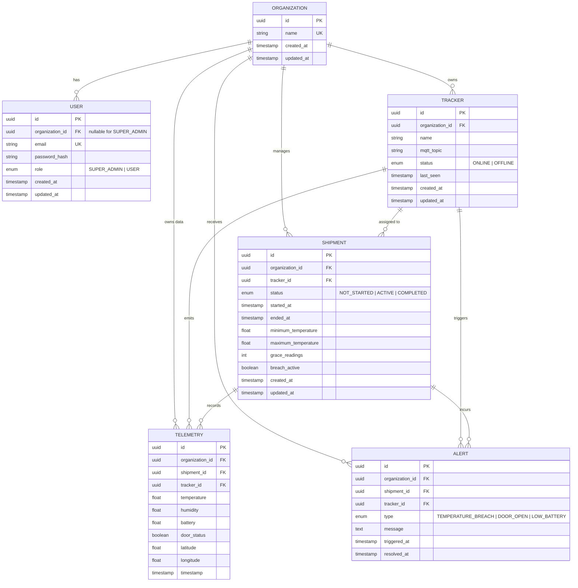

# Cold-Chain Monitoring Platform — Database Schema & Multi-Tenant Architecture

## Overview
This document outlines the database domain models, table schemas, relationships, indexing strategies, and multi-tenant design patterns implemented in **Phase 2** for the Cold-Chain Monitoring Platform.

The schema is built on **PostgreSQL** using **SQLAlchemy 2.0 (typed declarative mapping)** and managed through **Alembic** migrations. All primary keys use native PostgreSQL UUIDs to ensure globally unique identifiers and avoid enumerable sequence attacks.

---

## 1. Multi-Tenant Architectural Design

### Tenancy Boundary: The `Organization`
In this platform, an **Organization** represents a distinct customer/tenant account. All operations, assets, and time-series sensor data are logically isolated per organization:

```text
Organization (Tenant Root)
├── Users       (Operators & Organization Admins)
├── Trackers    (IoT hardware assigned to the tenant)
├── Shipments   (Active/historical refrigerated transit records)
│     ├── Telemetry  (Time-series temperature/GPS data)
│     └── Alerts     (Breach events and warnings)
```

### Why `organization_id` is Explicitly Stored on Every Entity
Rather than relying solely on multi-hop transitive joins (e.g. `Telemetry -> Shipment -> Organization`), `organization_id` is explicitly indexed as a direct foreign key on:
- `users.organization_id`
- `trackers.organization_id`
- `shipments.organization_id`
- `telemetry.organization_id`
- `alerts.organization_id`

**Key Rationale:**
1. **Direct Organization-Scoped Queries:** High-throughput queries (e.g. streaming dashboards, live maps, telemetry queries) can be scoped directly with `WHERE organization_id = :org_id` without requiring expensive joins across `shipments` or `trackers`.
2. **Defensive Tenant Isolation:** Prevents cross-tenant data leaks and accidental cross-tenant queries at the data layer.
3. **Partitioning Readiness:** Having `organization_id` present on high-volume tables like `telemetry` enables seamless future database partitioning by tenant/time if dataset sizes expand.

---

## 2. Table Specifications

### 2.1. `organizations` Table
Represents client tenants using the platform.

| Column | Type | Constraints | Description |
| :--- | :--- | :--- | :--- |
| `id` | `UUID` | `PRIMARY KEY` | Unique organization identifier (UUID v4) |
| `name` | `VARCHAR(255)` | `NOT NULL`, `UNIQUE`, `INDEXED` | Unique organization display name |
| `created_at` | `TIMESTAMP WITH TIME ZONE` | `NOT NULL`, `DEFAULT now()` | Timestamp of tenant registration |
| `updated_at` | `TIMESTAMP WITH TIME ZONE` | `NOT NULL`, `DEFAULT now()` | Timestamp of last tenant profile update |

**Relationships:**
- One-to-many with `users`
- One-to-many with `trackers`
- One-to-many with `shipments`
- One-to-many with `telemetry`
- One-to-many with `alerts`

---

### 2.2. `users` Table
Stores credentials and role assignments for platform users.

| Column | Type | Constraints | Description |
| :--- | :--- | :--- | :--- |
| `id` | `UUID` | `PRIMARY KEY` | Unique user identifier (UUID v4) |
| `organization_id` | `UUID` | `NULLABLE`, `FK -> organizations.id ON DELETE SET NULL`, `INDEXED` | Tenant ID (NULL for `SUPER_ADMIN`, NOT NULL for tenant `USER`) |
| `email` | `VARCHAR(255)` | `NOT NULL`, `UNIQUE`, `INDEXED` | User email address for authentication |
| `password_hash` | `VARCHAR(255)` | `NOT NULL` | Stored secure password hash (never plaintext) |
| `role` | `VARCHAR(20)` | `NOT NULL`, `CHECK (role IN ('SUPER_ADMIN', 'USER'))` | Access role of the user |
| `created_at` | `TIMESTAMP WITH TIME ZONE` | `NOT NULL`, `DEFAULT now()` | Timestamp of account creation |
| `updated_at` | `TIMESTAMP WITH TIME ZONE` | `NOT NULL`, `DEFAULT now()` | Timestamp of last update |

**Role Model:**
- `USER`: Scoped strictly to one organization (`organization_id` is required).
- `SUPER_ADMIN`: Platform-wide administrator not tied to any single organization (`organization_id` is null).

---

### 2.3. `trackers` Table
Represents physical or simulated IoT cold-chain sensor devices.

| Column | Type | Constraints | Description |
| :--- | :--- | :--- | :--- |
| `id` | `UUID` | `PRIMARY KEY` | Unique tracker identifier |
| `organization_id` | `UUID` | `NOT NULL`, `FK -> organizations.id ON DELETE RESTRICT`, `INDEXED` | Owning organization |
| `name` | `VARCHAR(255)` | `NOT NULL` | Friendly name / identifier of the tracker |
| `mqtt_topic` | `VARCHAR(255)` | `NOT NULL`, `INDEXED` | MQTT topic used for ingestion (`broker.emqx.io`) |
| `status` | `VARCHAR(20)` | `NOT NULL`, `CHECK (status IN ('ONLINE', 'OFFLINE'))` | Current device connectivity status |
| `last_seen` | `TIMESTAMP WITH TIME ZONE` | `NULLABLE` | Timestamp of latest reading received |
| `created_at` | `TIMESTAMP WITH TIME ZONE` | `NOT NULL`, `DEFAULT now()` | Device registration timestamp |
| `updated_at` | `TIMESTAMP WITH TIME ZONE` | `NOT NULL`, `DEFAULT now()` | Last update timestamp |

**Delete Protection:** Uses `ON DELETE RESTRICT` on `organization_id` to prevent accidental deletion of organizations with active trackers.

---

### 2.4. `shipments` Table
Encapsulates a transit journey for temperature-sensitive cargo.

| Column | Type | Constraints | Description |
| :--- | :--- | :--- | :--- |
| `id` | `UUID` | `PRIMARY KEY` | Unique shipment identifier |
| `organization_id` | `UUID` | `NOT NULL`, `FK -> organizations.id ON DELETE RESTRICT`, `INDEXED` | Owning organization |
| `tracker_id` | `UUID` | `NOT NULL`, `FK -> trackers.id ON DELETE RESTRICT`, `INDEXED` | Tracker assigned to this shipment |
| `status` | `VARCHAR(20)` | `NOT NULL`, `CHECK (status IN ('NOT_STARTED', 'ACTIVE', 'COMPLETED'))`, `INDEXED` | Shipment transit lifecycle state |
| `started_at` | `TIMESTAMP WITH TIME ZONE` | `NULLABLE` | Transit start timestamp (opens telemetry recording gate) |
| `ended_at` | `TIMESTAMP WITH TIME ZONE` | `NULLABLE` | Transit completion timestamp (closes recording gate) |
| `minimum_temperature` | `DOUBLE PRECISION` | `NOT NULL` | Lower permitted threshold in °C |
| `maximum_temperature` | `DOUBLE PRECISION` | `NOT NULL` | Upper permitted threshold in °C |
| `grace_readings` | `INTEGER` | `NOT NULL`, `DEFAULT 0` | Consecutive readings outside range allowed before alert |
| `breach_active` | `BOOLEAN` | `NOT NULL`, `DEFAULT FALSE` | Flag tracking active violation to avoid repeated emails |
| `created_at` | `TIMESTAMP WITH TIME ZONE` | `NOT NULL`, `DEFAULT now()` | Creation timestamp |
| `updated_at` | `TIMESTAMP WITH TIME ZONE` | `NOT NULL`, `DEFAULT now()` | Last update timestamp |

**Shipment Lifecycle & Temperature Profile:**
- `status`: Transitions `NOT_STARTED -> ACTIVE -> COMPLETED`.
- `started_at` / `ended_at`: Implements the shipment gate requirement — telemetry is only recorded during active shipments.
- `minimum_temperature` & `maximum_temperature`: Define the permitted safe cold-chain envelope.
- `grace_readings`: Defines hysteresis/tolerance so transient sensor spikes do not prematurely trigger alerts.
- `breach_active`: State persistence ensuring only one alert email is sent per continuous breach period.

---

### 2.5. `telemetry` Table
Time-series sensor readings recorded exclusively during active shipments.

| Column | Type | Constraints | Description |
| :--- | :--- | :--- | :--- |
| `id` | `UUID` | `PRIMARY KEY` | Unique reading identifier |
| `organization_id` | `UUID` | `NOT NULL`, `FK -> organizations.id ON DELETE RESTRICT`, `INDEXED` | Owning organization |
| `shipment_id` | `UUID` | `NOT NULL`, `FK -> shipments.id ON DELETE RESTRICT`, `INDEXED` | Shipment transit session |
| `tracker_id` | `UUID` | `NOT NULL`, `FK -> trackers.id ON DELETE RESTRICT`, `INDEXED` | Physical device source |
| `temperature` | `DOUBLE PRECISION` | `NOT NULL` | Cargo temperature reading in °C |
| `humidity` | `DOUBLE PRECISION` | `NOT NULL` | Ambient relative humidity percentage (%) |
| `battery` | `DOUBLE PRECISION` | `NOT NULL` | Tracker battery level (0–100%) |
| `door_status` | `BOOLEAN` | `NOT NULL` | Container door status (`TRUE` for open, `FALSE` for closed) |
| `latitude` | `DOUBLE PRECISION` | `NOT NULL` | GPS latitude coordinate |
| `longitude` | `DOUBLE PRECISION` | `NOT NULL` | GPS longitude coordinate |
| `timestamp` | `TIMESTAMP WITH TIME ZONE` | `NOT NULL`, `INDEXED` | Sensor reading capture timestamp |

**Composite Time-Series Indexes:**
- `ix_telemetry_shipment_timestamp`: `(shipment_id, timestamp)` — Optimizes historical temperature chart queries and GPS trails.
- `ix_telemetry_tracker_timestamp`: `(tracker_id, timestamp)` — Optimizes device-level telemetry stream analysis.
- `ix_telemetry_org_timestamp`: `(organization_id, timestamp)` — Optimizes tenant-wide live monitoring and reporting.

**Data Retention & Cascade Rule:**
- Foreign keys use `ondelete='RESTRICT'`. Historical telemetry is legally critical for cold-chain compliance and cannot be accidentally cascade-deleted.

---

### 2.6. `alerts` Table
Persisted alert events triggered when readings violate temperature or operational thresholds.

| Column | Type | Constraints | Description |
| :--- | :--- | :--- | :--- |
| `id` | `UUID` | `PRIMARY KEY` | Unique alert identifier |
| `organization_id` | `UUID` | `NOT NULL`, `FK -> organizations.id ON DELETE RESTRICT`, `INDEXED` | Owning organization |
| `shipment_id` | `UUID` | `NOT NULL`, `FK -> shipments.id ON DELETE RESTRICT`, `INDEXED` | Shipment context of the violation |
| `tracker_id` | `UUID` | `NOT NULL`, `FK -> trackers.id ON DELETE RESTRICT`, `INDEXED` | Tracker emitting the violation |
| `type` | `VARCHAR(50)` | `NOT NULL`, `CHECK (type IN ('TEMPERATURE_BREACH', 'DOOR_OPEN', 'LOW_BATTERY'))`, `INDEXED` | Alert classification |
| `message` | `TEXT` | `NOT NULL` | Human-readable explanation of breach |
| `triggered_at` | `TIMESTAMP WITH TIME ZONE` | `NOT NULL`, `INDEXED` | Timestamp when the condition tripped |
| `resolved_at` | `TIMESTAMP WITH TIME ZONE` | `NULLABLE` | Timestamp when the condition normalized |

**Composite Indexes:**
- `ix_alerts_shipment_triggered`: `(shipment_id, triggered_at)`
- `ix_alerts_org_triggered`: `(organization_id, triggered_at)`

---

## 3. Entity-Relationship Diagram


